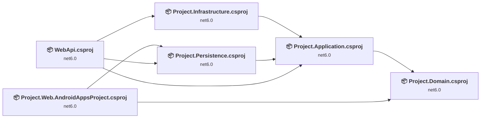
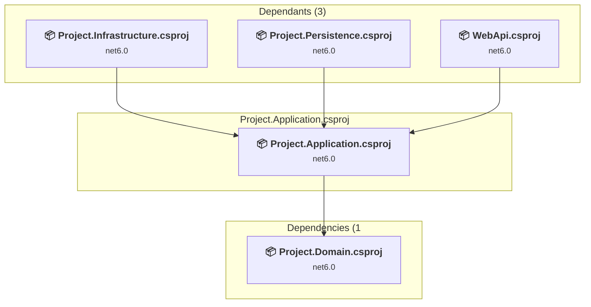
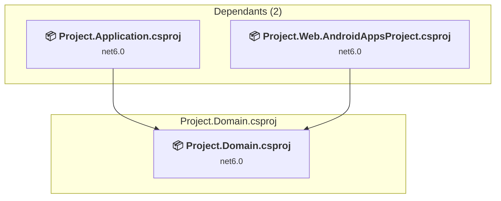
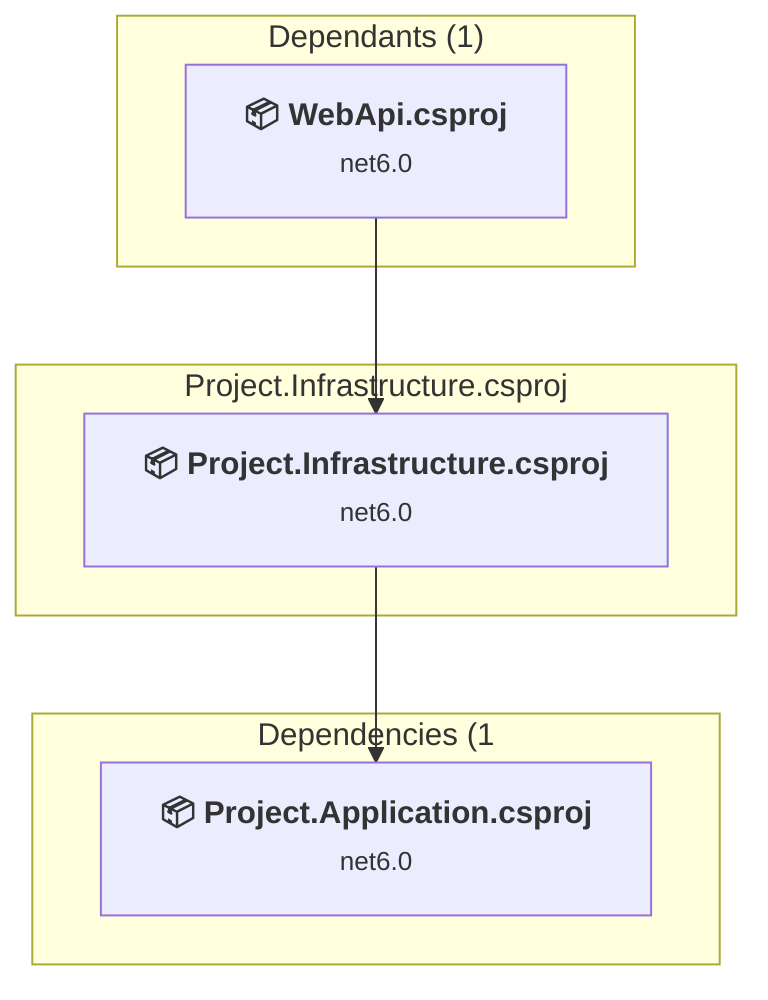
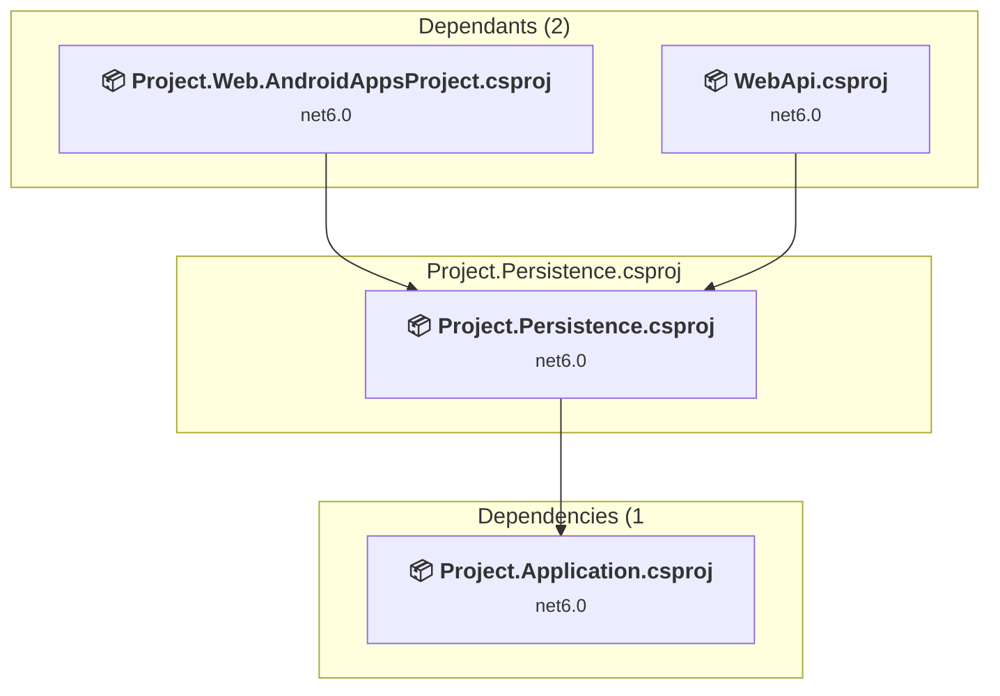
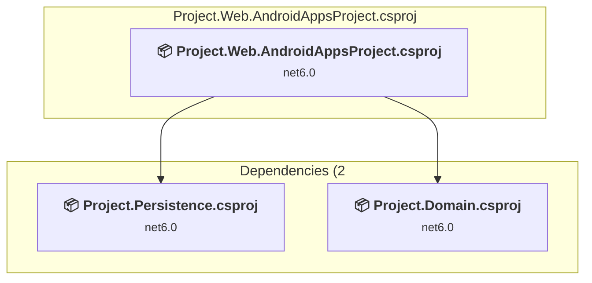
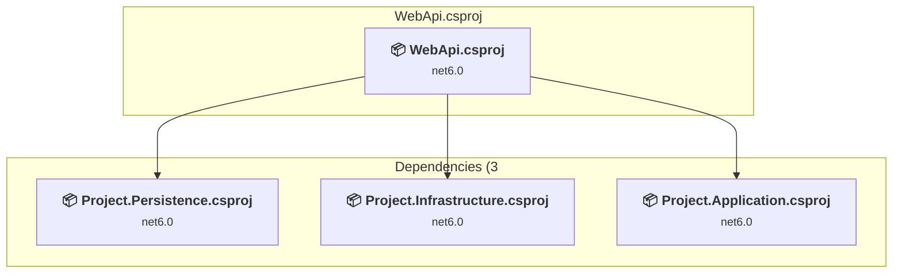

# Projects and dependencies analysis

This document provides a comprehensive overview of the projects and their dependencies in the context of upgrading to .NETCoreApp,Version=v10.0.

## Table of Contents

- [Executive Summary](#executive-Summary)
  - [Highlevel Metrics](#highlevel-metrics)
  - [Projects Compatibility](#projects-compatibility)
  - [Package Compatibility](#package-compatibility)
  - [API Compatibility](#api-compatibility)
  - [Binding Redirect Configuration](#binding-redirect-configuration)
- [Aggregate NuGet packages details](#aggregate-nuget-packages-details)
- [Top API Migration Challenges](#top-api-migration-challenges)
  - [Technologies and Features](#technologies-and-features)
  - [Most Frequent API Issues](#most-frequent-api-issues)
- [Projects Relationship Graph](#projects-relationship-graph)
- [Project Details](#project-details)

  - [CMS\Project.Application\Project.Application.csproj](#cmsprojectapplicationprojectapplicationcsproj)
  - [CMS\Project.Domain\Project.Domain.csproj](#cmsprojectdomainprojectdomaincsproj)
  - [CMS\Project.Infrastructure\Project.Infrastructure.csproj](#cmsprojectinfrastructureprojectinfrastructurecsproj)
  - [CMS\Project.Persistence\Project.Persistence.csproj](#cmsprojectpersistenceprojectpersistencecsproj)
  - [CMS\Project.Web.AndroidAppsProject\Project.Web.AndroidAppsProject.csproj](#cmsprojectwebandroidappsprojectprojectwebandroidappsprojectcsproj)
  - [CMS\Project.Web.Api\WebApi\WebApi.csproj](#cmsprojectwebapiwebapiwebapicsproj)

## Executive Summary

### Highlevel Metrics

| Metric | Count | Status |
| :--- | :---: | :--- |
| Total Projects | 6 | All require upgrade |
| Total NuGet Packages | 35 | 22 need upgrade |
| Total Code Files | 285 |  |
| Total Code Files with Incidents | 14 |  |
| Total Lines of Code | 45503 |  |
| Total Number of Issues | 52 |  |
| Estimated LOC to modify | 19+ | at least 0.0% of codebase |

### Projects Compatibility

| Project | Target Framework | Difficulty | Package Issues | API Issues | Binding Issues | Est. LOC Impact | Description |
| :--- | :---: | :---: | :---: | :---: | :---: | :---: | :--- |
| [CMS\Project.Application\Project.Application.csproj](#cmsprojectapplicationprojectapplicationcsproj) | net6.0 | 🟢 Low | 8 | 11 | 0 | 11+ | ClassLibrary, Sdk Style = True |
| [CMS\Project.Domain\Project.Domain.csproj](#cmsprojectdomainprojectdomaincsproj) | net6.0 | 🟢 Low | 2 | 0 | 0 |  | ClassLibrary, Sdk Style = True |
| [CMS\Project.Infrastructure\Project.Infrastructure.csproj](#cmsprojectinfrastructureprojectinfrastructurecsproj) | net6.0 | 🟢 Low | 3 | 0 | 0 |  | ClassLibrary, Sdk Style = True |
| [CMS\Project.Persistence\Project.Persistence.csproj](#cmsprojectpersistenceprojectpersistencecsproj) | net6.0 | 🟢 Low | 6 | 0 | 0 |  | ClassLibrary, Sdk Style = True |
| [CMS\Project.Web.AndroidAppsProject\Project.Web.AndroidAppsProject.csproj](#cmsprojectwebandroidappsprojectprojectwebandroidappsprojectcsproj) | net6.0 | 🟢 Low | 6 | 8 | 0 | 8+ | AspNetCore, Sdk Style = True |
| [CMS\Project.Web.Api\WebApi\WebApi.csproj](#cmsprojectwebapiwebapiwebapicsproj) | net6.0 | 🟢 Low | 2 | 0 | 0 |  | AspNetCore, Sdk Style = True |

### Package Compatibility

| Status | Count | Percentage |
| :--- | :---: | :---: |
| ✅ Compatible | 13 | 37.1% |
| ⚠️ Incompatible | 5 | 14.3% |
| 🔄 Upgrade Recommended | 17 | 48.6% |
| ***Total NuGet Packages*** | ***35*** | ***100%*** |

### API Compatibility

| Category | Count | Impact |
| :--- | :---: | :--- |
| 🔴 Binary Incompatible | 1 | High - Require code changes |
| 🟡 Source Incompatible | 16 | Medium - Needs re-compilation and potential conflicting API error fixing |
| 🔵 Behavioral change | 2 | Low - Behavioral changes that may require testing at runtime |
| ✅ Compatible | 92775 |  |
| ***Total APIs Analyzed*** | ***92794*** |  |

## Aggregate NuGet packages details

| Package | Current Version | Suggested Version | Projects | Description |
| :--- | :---: | :---: | :--- | :--- |
| AutoMapper | 12.0.1 | 16.2.0 | [Project.Application.csproj](#cmsprojectapplicationprojectapplicationcsproj) | NuGet package contains security vulnerability |
| AutoMapper.Extensions.Microsoft.DependencyInjection | 12.0.1 |  | [Project.Application.csproj](#cmsprojectapplicationprojectapplicationcsproj) | ⚠️NuGet package is deprecated |
| CloudFlare.Client | 6.3.0 |  | [Project.Application.csproj](#cmsprojectapplicationprojectapplicationcsproj) [Project.Web.AndroidAppsProject.csproj](#cmsprojectwebandroidappsprojectprojectwebandroidappsprojectcsproj) | ✅Compatible |
| CloudFlare.NET | 0.1.1 |  | [Project.Application.csproj](#cmsprojectapplicationprojectapplicationcsproj) | ⚠️NuGet package is incompatible |
| Dapper | 2.1.28 |  | [Project.Web.AndroidAppsProject.csproj](#cmsprojectwebandroidappsprojectprojectwebandroidappsprojectcsproj) | ✅Compatible |
| DNTCommon.Web.Core | 3.5.0 |  | [Project.Web.AndroidAppsProject.csproj](#cmsprojectwebandroidappsprojectprojectwebandroidappsprojectcsproj) | ✅Compatible |
| DNTPersianUtils.Core | 5.4.4 |  | [Project.Application.csproj](#cmsprojectapplicationprojectapplicationcsproj) [Project.Infrastructure.csproj](#cmsprojectinfrastructureprojectinfrastructurecsproj) | ✅Compatible |
| FluentValidation.DependencyInjectionExtensions | 11.0.2 |  | [Project.Application.csproj](#cmsprojectapplicationprojectapplicationcsproj) | ✅Compatible |
| Hangfire.AspNetCore | 1.8.7 |  | [Project.Web.AndroidAppsProject.csproj](#cmsprojectwebandroidappsprojectprojectwebandroidappsprojectcsproj) | ✅Compatible |
| Hangfire.Core | 1.8.7 |  | [Project.Web.AndroidAppsProject.csproj](#cmsprojectwebandroidappsprojectprojectwebandroidappsprojectcsproj) | ✅Compatible |
| Hangfire.MemoryStorage | 1.8.0 |  | [Project.Web.AndroidAppsProject.csproj](#cmsprojectwebandroidappsprojectprojectwebandroidappsprojectcsproj) | ✅Compatible |
| Microsoft.AspNetCore.Http.Abstractions | 2.2.0 |  | [Project.Application.csproj](#cmsprojectapplicationprojectapplicationcsproj) [Project.Persistence.csproj](#cmsprojectpersistenceprojectpersistencecsproj) | ⚠️NuGet package is deprecated |
| Microsoft.AspNetCore.Http.Features | 5.0.17 |  | [Project.Application.csproj](#cmsprojectapplicationprojectapplicationcsproj) [Project.Infrastructure.csproj](#cmsprojectinfrastructureprojectinfrastructurecsproj) | ⚠️NuGet package is deprecated |
| Microsoft.AspNetCore.Identity.EntityFrameworkCore | 6.0.11 | 10.0.10 | [Project.Persistence.csproj](#cmsprojectpersistenceprojectpersistencecsproj) | NuGet package upgrade is recommended |
| Microsoft.AspNetCore.Mvc.Formatters.Json | 2.2.0 |  | [Project.Application.csproj](#cmsprojectapplicationprojectapplicationcsproj) | ⚠️NuGet package is deprecated |
| Microsoft.AspNetCore.Mvc.NewtonsoftJson | 6.0.11 | 10.0.10 | [Project.Web.AndroidAppsProject.csproj](#cmsprojectwebandroidappsprojectprojectwebandroidappsprojectcsproj) | NuGet package upgrade is recommended |
| Microsoft.Data.SqlClient | 5.1.0 | 7.0.2 | [Project.Web.AndroidAppsProject.csproj](#cmsprojectwebandroidappsprojectprojectwebandroidappsprojectcsproj) | NuGet package contains security vulnerability |
| Microsoft.EntityFrameworkCore | 6.0.5 | 10.0.10 | [Project.Application.csproj](#cmsprojectapplicationprojectapplicationcsproj) | NuGet package upgrade is recommended |
| Microsoft.EntityFrameworkCore.Abstractions | 6.0.5 | 10.0.10 | [Project.Domain.csproj](#cmsprojectdomainprojectdomaincsproj) | NuGet package upgrade is recommended |
| Microsoft.EntityFrameworkCore.Proxies | 6.0.5 | 10.0.10 | [Project.Persistence.csproj](#cmsprojectpersistenceprojectpersistencecsproj) | NuGet package upgrade is recommended |
| Microsoft.EntityFrameworkCore.SqlServer | 6.0.11 | 10.0.10 | [Project.Web.AndroidAppsProject.csproj](#cmsprojectwebandroidappsprojectprojectwebandroidappsprojectcsproj) | NuGet package upgrade is recommended |
| Microsoft.EntityFrameworkCore.SqlServer | 6.0.5 | 10.0.10 | [Project.Persistence.csproj](#cmsprojectpersistenceprojectpersistencecsproj) | NuGet package upgrade is recommended |
| Microsoft.EntityFrameworkCore.SqlServer | 7.0.9 | 10.0.10 | [WebApi.csproj](#cmsprojectwebapiwebapiwebapicsproj) | NuGet package upgrade is recommended |
| Microsoft.EntityFrameworkCore.Tools | 6.0.11 | 10.0.10 | [Project.Web.AndroidAppsProject.csproj](#cmsprojectwebandroidappsprojectprojectwebandroidappsprojectcsproj) | NuGet package upgrade is recommended |
| Microsoft.EntityFrameworkCore.Tools | 6.0.5 | 10.0.10 | [Project.Application.csproj](#cmsprojectapplicationprojectapplicationcsproj) [Project.Persistence.csproj](#cmsprojectpersistenceprojectpersistencecsproj) | NuGet package upgrade is recommended |
| Microsoft.EntityFrameworkCore.Tools | 7.0.9 | 10.0.10 | [WebApi.csproj](#cmsprojectwebapiwebapiwebapicsproj) | NuGet package upgrade is recommended |
| Microsoft.Extensions.Caching.Memory | 8.0.0-preview.7.23375.6 | 10.0.10 | [Project.Web.AndroidAppsProject.csproj](#cmsprojectwebandroidappsprojectprojectwebandroidappsprojectcsproj) | NuGet package upgrade is recommended |
| Microsoft.Extensions.Identity.Stores | 6.0.11 | 10.0.10 | [Project.Domain.csproj](#cmsprojectdomainprojectdomaincsproj) | NuGet package upgrade is recommended |
| Microsoft.Extensions.Options.ConfigurationExtensions | 6.0.0 | 10.0.10 | [Project.Infrastructure.csproj](#cmsprojectinfrastructureprojectinfrastructurecsproj) [Project.Persistence.csproj](#cmsprojectpersistenceprojectpersistencecsproj) | NuGet package upgrade is recommended |
| RestSharp | 107.3.0 | 114.0.0 | [Project.Infrastructure.csproj](#cmsprojectinfrastructureprojectinfrastructurecsproj) | NuGet package contains security vulnerability |
| SendGrid | 9.28.0 |  | [Project.Infrastructure.csproj](#cmsprojectinfrastructureprojectinfrastructurecsproj) | ✅Compatible |
| Serilog | 3.1.1 |  | [Project.Application.csproj](#cmsprojectapplicationprojectapplicationcsproj) [Project.Domain.csproj](#cmsprojectdomainprojectdomaincsproj) [Project.Infrastructure.csproj](#cmsprojectinfrastructureprojectinfrastructurecsproj) [Project.Persistence.csproj](#cmsprojectpersistenceprojectpersistencecsproj) [Project.Web.AndroidAppsProject.csproj](#cmsprojectwebandroidappsprojectprojectwebandroidappsprojectcsproj) | ✅Compatible |
| Serilog.Extensions.Hosting | 8.0.0 |  | [Project.Web.AndroidAppsProject.csproj](#cmsprojectwebandroidappsprojectprojectwebandroidappsprojectcsproj) | ✅Compatible |
| Serilog.Sinks.File | 5.0.1-dev-00972 |  | [Project.Web.AndroidAppsProject.csproj](#cmsprojectwebandroidappsprojectprojectwebandroidappsprojectcsproj) | ✅Compatible |
| Swashbuckle.AspNetCore | 6.5.0 |  | [WebApi.csproj](#cmsprojectwebapiwebapiwebapicsproj) | ✅Compatible |

## Top API Migration Challenges

### Technologies and Features

| Technology | Issues | Percentage | Migration Path |
| :--- | :---: | :---: | :--- |

### Most Frequent API Issues

| API | Count | Percentage | Category |
| :--- | :---: | :---: | :--- |
| M:System.TimeSpan.FromMinutes(System.Double) | 12 | 63.2% | Source Incompatible |
| M:System.TimeSpan.FromHours(System.Double) | 1 | 5.3% | Source Incompatible |
| T:System.Net.Http.HttpContent | 1 | 5.3% | Behavioral Change |
| T:Microsoft.Extensions.DependencyInjection.ServiceCollectionExtensions | 1 | 5.3% | Binary Incompatible |
| M:Microsoft.AspNetCore.Builder.ExceptionHandlerExtensions.UseExceptionHandler(Microsoft.AspNetCore.Builder.IApplicationBuilder,System.String) | 1 | 5.3% | Behavioral Change |
| M:System.TimeSpan.FromDays(System.Double) | 1 | 5.3% | Source Incompatible |
| T:Microsoft.Extensions.DependencyInjection.IdentityEntityFrameworkBuilderExtensions | 1 | 5.3% | Source Incompatible |
| M:Microsoft.Extensions.DependencyInjection.IdentityEntityFrameworkBuilderExtensions.AddEntityFrameworkStores''1(Microsoft.AspNetCore.Identity.IdentityBuilder) | 1 | 5.3% | Source Incompatible |

## Projects Relationship Graph

Legend:
📦 SDK-style project
⚙️ Classic project

## Project Details

### CMS\Project.Application\Project.Application.csproj

#### Project Info

- **Current Target Framework:** net6.0
- **Proposed Target Framework:** net10.0
- **SDK-style**: True
- **Project Kind:** ClassLibrary
- **Dependencies**: 1
- **Dependants**: 3
- **Number of Files**: 112
- **Number of Files with Incidents**: 7
- **Lines of Code**: 3868
- **Estimated LOC to modify**: 11+ (at least 0.3% of the project)

#### Dependency Graph

Legend:
📦 SDK-style project
⚙️ Classic project

### API Compatibility

| Category | Count | Impact |
| :--- | :---: | :--- |
| 🔴 Binary Incompatible | 1 | High - Require code changes |
| 🟡 Source Incompatible | 9 | Medium - Needs re-compilation and potential conflicting API error fixing |
| 🔵 Behavioral change | 1 | Low - Behavioral changes that may require testing at runtime |
| ✅ Compatible | 4573 |  |
| ***Total APIs Analyzed*** | ***4584*** |  |

### CMS\Project.Domain\Project.Domain.csproj

#### Project Info

- **Current Target Framework:** net6.0
- **Proposed Target Framework:** net10.0
- **SDK-style**: True
- **Project Kind:** ClassLibrary
- **Dependencies**: 0
- **Dependants**: 2
- **Number of Files**: 17
- **Number of Files with Incidents**: 1
- **Lines of Code**: 320
- **Estimated LOC to modify**: 0+ (at least 0.0% of the project)

#### Dependency Graph

Legend:
📦 SDK-style project
⚙️ Classic project

### API Compatibility

| Category | Count | Impact |
| :--- | :---: | :--- |
| 🔴 Binary Incompatible | 0 | High - Require code changes |
| 🟡 Source Incompatible | 0 | Medium - Needs re-compilation and potential conflicting API error fixing |
| 🔵 Behavioral change | 0 | Low - Behavioral changes that may require testing at runtime |
| ✅ Compatible | 484 |  |
| ***Total APIs Analyzed*** | ***484*** |  |

### CMS\Project.Infrastructure\Project.Infrastructure.csproj

#### Project Info

- **Current Target Framework:** net6.0
- **Proposed Target Framework:** net10.0
- **SDK-style**: True
- **Project Kind:** ClassLibrary
- **Dependencies**: 1
- **Dependants**: 1
- **Number of Files**: 4
- **Number of Files with Incidents**: 1
- **Lines of Code**: 175
- **Estimated LOC to modify**: 0+ (at least 0.0% of the project)

#### Dependency Graph

Legend:
📦 SDK-style project
⚙️ Classic project

### API Compatibility

| Category | Count | Impact |
| :--- | :---: | :--- |
| 🔴 Binary Incompatible | 0 | High - Require code changes |
| 🟡 Source Incompatible | 0 | Medium - Needs re-compilation and potential conflicting API error fixing |
| 🔵 Behavioral change | 0 | Low - Behavioral changes that may require testing at runtime |
| ✅ Compatible | 203 |  |
| ***Total APIs Analyzed*** | ***203*** |  |

### CMS\Project.Persistence\Project.Persistence.csproj

#### Project Info

- **Current Target Framework:** net6.0
- **Proposed Target Framework:** net10.0
- **SDK-style**: True
- **Project Kind:** ClassLibrary
- **Dependencies**: 1
- **Dependants**: 2
- **Number of Files**: 98
- **Number of Files with Incidents**: 1
- **Lines of Code**: 35959
- **Estimated LOC to modify**: 0+ (at least 0.0% of the project)

#### Dependency Graph

Legend:
📦 SDK-style project
⚙️ Classic project

### API Compatibility

| Category | Count | Impact |
| :--- | :---: | :--- |
| 🔴 Binary Incompatible | 0 | High - Require code changes |
| 🟡 Source Incompatible | 0 | Medium - Needs re-compilation and potential conflicting API error fixing |
| 🔵 Behavioral change | 0 | Low - Behavioral changes that may require testing at runtime |
| ✅ Compatible | 52342 |  |
| ***Total APIs Analyzed*** | ***52342*** |  |

### CMS\Project.Web.AndroidAppsProject\Project.Web.AndroidAppsProject.csproj

#### Project Info

- **Current Target Framework:** net6.0
- **Proposed Target Framework:** net10.0
- **SDK-style**: True
- **Project Kind:** AspNetCore
- **Dependencies**: 2
- **Dependants**: 0
- **Number of Files**: 1589
- **Number of Files with Incidents**: 3
- **Lines of Code**: 5094
- **Estimated LOC to modify**: 8+ (at least 0.2% of the project)

#### Dependency Graph

Legend:
📦 SDK-style project
⚙️ Classic project

### API Compatibility

| Category | Count | Impact |
| :--- | :---: | :--- |
| 🔴 Binary Incompatible | 0 | High - Require code changes |
| 🟡 Source Incompatible | 7 | Medium - Needs re-compilation and potential conflicting API error fixing |
| 🔵 Behavioral change | 1 | Low - Behavioral changes that may require testing at runtime |
| ✅ Compatible | 34992 |  |
| ***Total APIs Analyzed*** | ***35000*** |  |

### CMS\Project.Web.Api\WebApi\WebApi.csproj

#### Project Info

- **Current Target Framework:** net6.0
- **Proposed Target Framework:** net10.0
- **SDK-style**: True
- **Project Kind:** AspNetCore
- **Dependencies**: 3
- **Dependants**: 0
- **Number of Files**: 3
- **Number of Files with Incidents**: 1
- **Lines of Code**: 87
- **Estimated LOC to modify**: 0+ (at least 0.0% of the project)

#### Dependency Graph

Legend:
📦 SDK-style project
⚙️ Classic project

### API Compatibility

| Category | Count | Impact |
| :--- | :---: | :--- |
| 🔴 Binary Incompatible | 0 | High - Require code changes |
| 🟡 Source Incompatible | 0 | Medium - Needs re-compilation and potential conflicting API error fixing |
| 🔵 Behavioral change | 0 | Low - Behavioral changes that may require testing at runtime |
| ✅ Compatible | 181 |  |
| ***Total APIs Analyzed*** | ***181*** |  |

